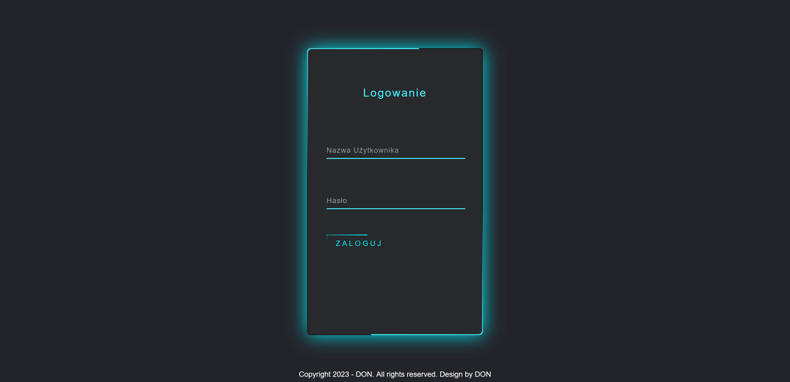
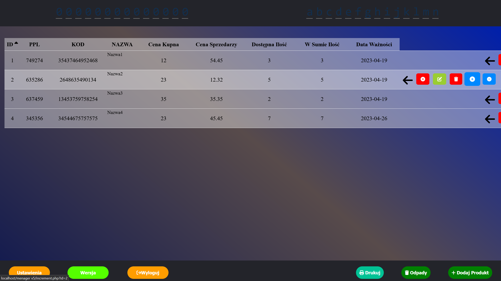
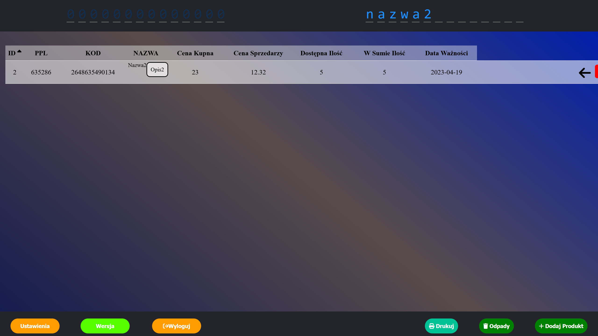
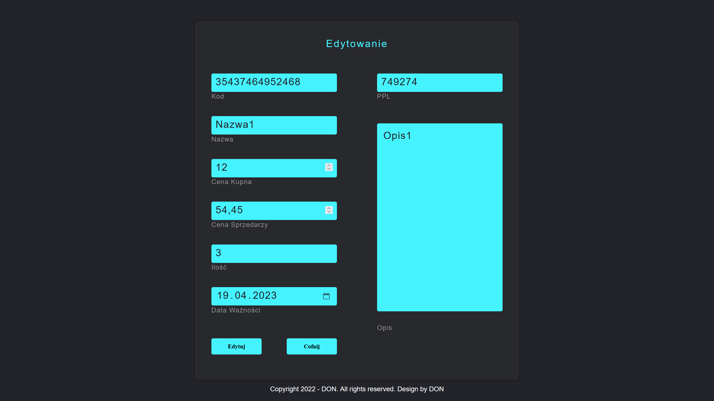
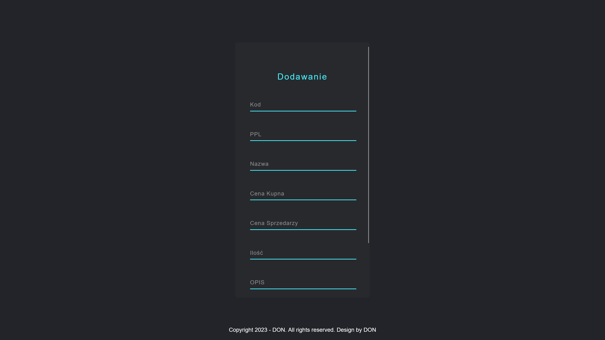
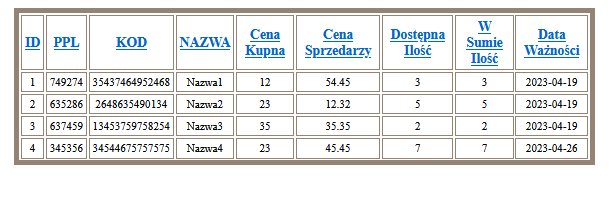

# menager

### Języki: HTML, Css, JavaScript

## W pełni działająca aplikacja do zarządzania magazynem. Szyfrowane logowanie do aplikacji, dodawanie, usuwanie oraz edycja produktów w aplikacji. Prosta zmiana stanu asortymentu.

